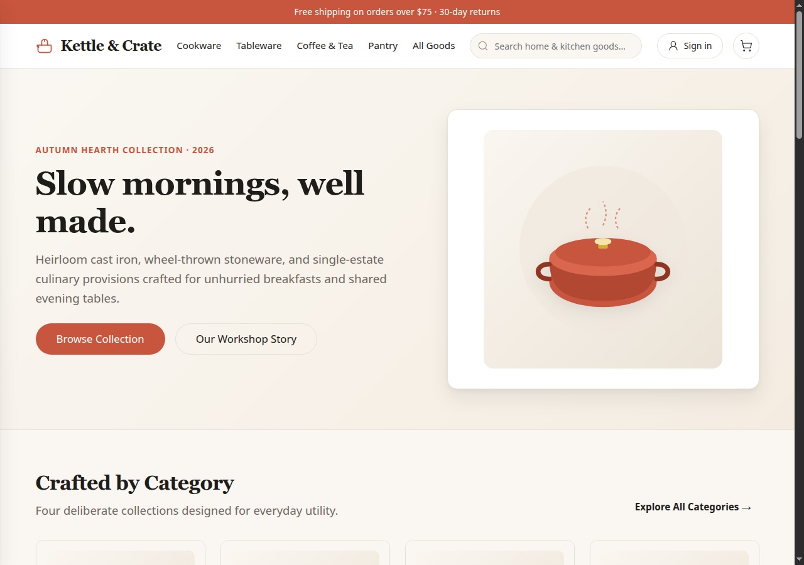
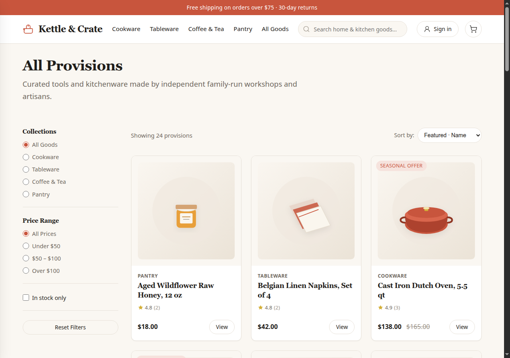
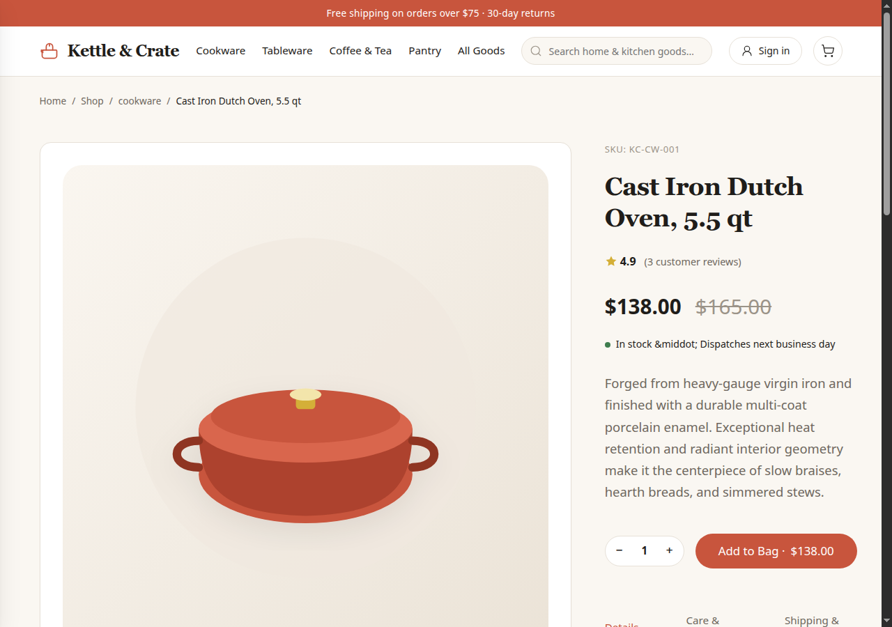
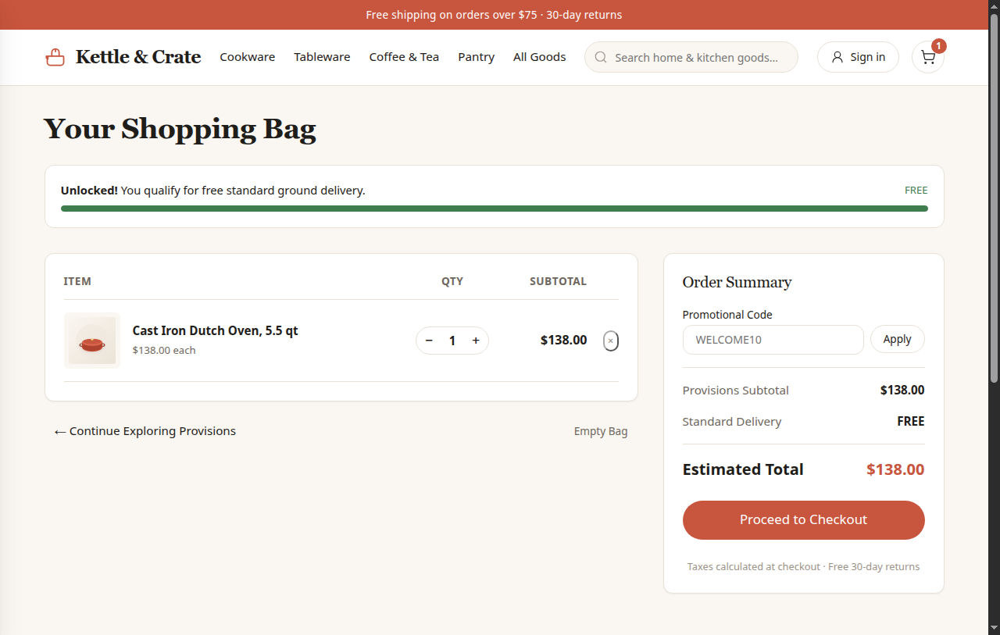
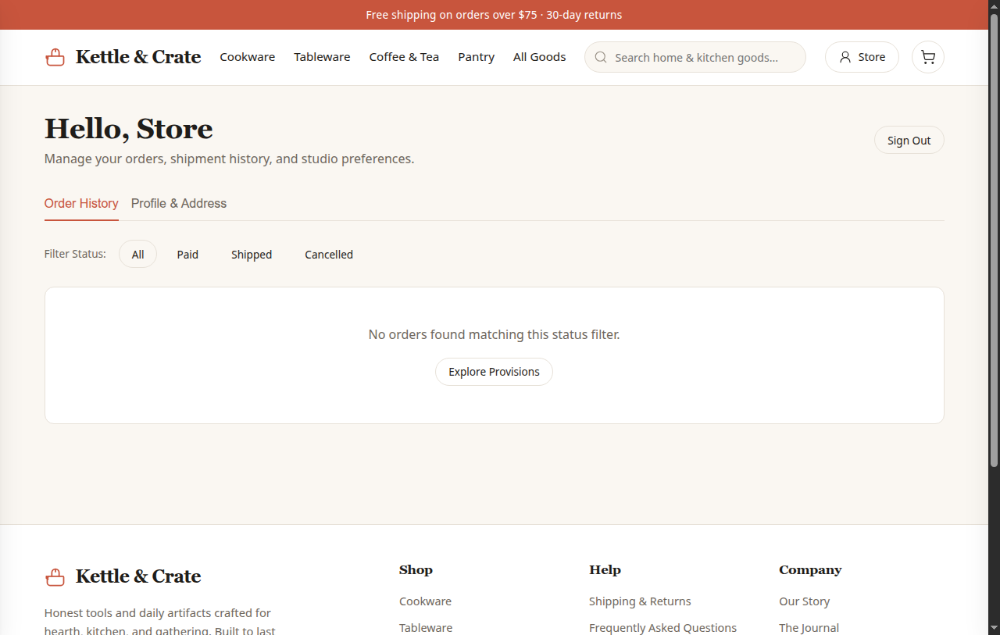
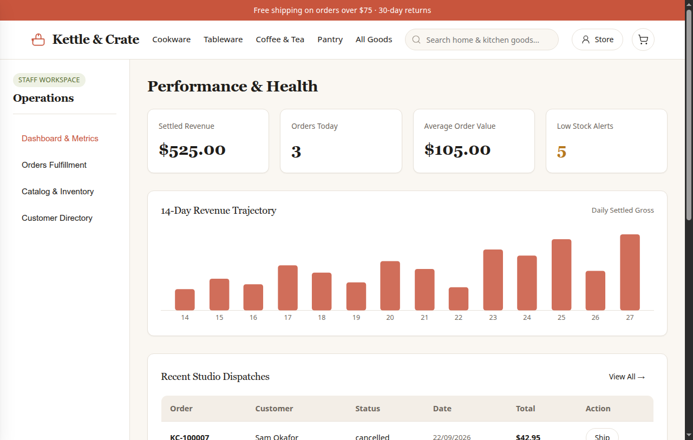

# Kettle & Crate

**Kettle & Crate** is an online storefront and operations platform for heirloom kitchenware, handcrafted ceramics, and small-batch provisions. Built for independent craft workshops, the platform combines a warm editorial aesthetic with an in-memory repository architecture, deterministic seeding, real-time cart calculations, checkout processing, order lifecycle tracking, and administrative intelligence.

---

## Interface Overview

### Storefront & Seasonal Collection


### Provisions Catalog & Filtering


### Product Detail & Community Reviews


### Shopping Bag & Free Shipping Threshold Tracker


### Customer Portal & Order History


### Administrative Operations & Revenue Intelligence


---

## Architectural Highlights

- **Pure Offline Runtime**: Built using vanilla HTML5, CSS3 custom properties, and native ES modules without build tools, compilers, CDNs, or external web fonts.
- **In-Memory Repository Architecture**: Engineered using the repository pattern (`src/store/`), providing deterministic state isolation, sequential integer primary keys, and counter-based identifiers (`KC-100001`, `ch_000001`, `rf_000001`).
- **Cryptographic Security**: Passwords hashed with `node:crypto.scrypt` and individualized cryptographic salts. Stateless bearer authorization tokens manage sessions.
- **Asynchronous Payment Gateway**: Checkout simulates payment processor latency through an awaited gateway round-trip.
- **Fulfillment Lifecycle**: Complete order management supporting checkout, dispatch registration with parcel tracking numbers, cancellation, and partial or full refunds.
- **Editorial Experience**: Authentic storytelling across dedicated provisions pages, three in-depth culinary journal articles, comprehensive customer service policies, and an accounting CSV export utility.

---

## Technology Stack

- **Runtime**: Node.js 22 (`engines: { "node": ">=20" }`)
- **Web Framework**: Express 4
- **Automated Verification**: Vitest and Supertest
- **Frontend Architecture**: Vanilla HTML5, CSS3, Modern JavaScript (ES Modules)
- **Containerization**: Docker (`node:22-slim`, non-root execution)
- **Continuous Integration**: GitHub Actions workflow

---

## Getting Started

### Installation

Clone the repository and install the pinned dependencies:

```bash
npm install
```

### Starting the Server

Launch the production application:

```bash
npm start
```

The application will start, seed the deterministic catalog, and listen on the configured port:

```text
Kettle & Crate listening on :3000
```

Access the storefront in your web browser at `http://localhost:3000`.

### Running Verification Suite

Execute the automated suite:

```bash
npm test
```

### Container Execution

Build and run using the optimized multi-stage container configuration:

```bash
docker build -t kettle-and-crate .
docker run -p 3000:3000 kettle-and-crate
```

---

## Environment Variables

All configuration settings have sensible defaults, allowing the application to run out of the box with zero manual configuration:

| Variable | Description | Default |
| :--- | :--- | :--- |
| `PORT` | Network port for incoming HTTP traffic | `3000` |
| `HOST` | Interface address for network binding | `0.0.0.0` |
| `ADMIN_PASSWORD` | Password for the primary administrative profile | `admin-pass` |

---

## Seeded User Profiles

The platform boots with three seeded profiles and historical transactions:

| Role | Email Address | Password | Description |
| :--- | :--- | :--- | :--- |
| **Administrator** | `admin@kettleandcrate.com` | `admin-pass` | Full administrative workspace access |
| **Customer** | `nora.bennett@example.com` | `welcome-home` | Customer profile with 4 past orders across statuses |
| **Customer** | `sam.okafor@example.com` | `welcome-home` | Customer profile with 3 past orders across statuses |

### Promotional Codes

- **`WELCOME10`**: Applies a 10% discount to orders with a subtotal of $50.00 or greater.

---

## API Reference

All API routes communicate in JSON format with standard HTTP status codes.

### System & Catalog

| Method | Endpoint | Authorization | Description |
| :--- | :--- | :--- | :--- |
| `GET` | `/health` | None | Root operational health check |
| `GET` | `/api/categories` | None | Retrieve collection departments |
| `GET` | `/api/products` | Optional | Query catalog with filters (`category`, `q`, `sort`) |
| `GET` | `/api/products/:id` | Optional | Retrieve product specifications and reviews |
| `POST` | `/api/products/:id/reviews` | Bearer | Submit a customer rating and review |

### Authentication

| Method | Endpoint | Authorization | Description |
| :--- | :--- | :--- | :--- |
| `POST` | `/api/auth/signup` | None | Create a new customer profile |
| `POST` | `/api/auth/login` | None | Authenticate credentials and receive token |
| `POST` | `/api/auth/logout` | None | Terminate active bearer session |
| `GET` | `/api/me` | Bearer | Retrieve authenticated profile details |

### Orders & Checkout

| Method | Endpoint | Authorization | Description |
| :--- | :--- | :--- | :--- |
| `POST` | `/api/orders` | Bearer | Authorize checkout and place order |
| `GET` | `/api/orders` | Bearer | List order history for current customer |
| `GET` | `/api/orders/:id` | Bearer | View specific order details and tracking |
| `POST` | `/api/orders/:id/cancel` | Bearer | Cancel an unshipped order and process refund |

### Administration

| Method | Endpoint | Authorization | Description |
| :--- | :--- | :--- | :--- |
| `GET` | `/api/admin/stats` | Admin | Aggregate revenue, AOV, and inventory alerts |
| `GET` | `/api/admin/orders` | Admin | Retrieve all storefront orders with status filter |
| `POST` | `/api/orders/:id/ship` | Admin | Register dispatch with carrier and tracking |
| `POST` | `/api/orders/:id/refunds` | Admin | Issue partial or full refund credit |
| `POST` | `/api/products` | Admin | Create a new provision in the catalog |
| `PATCH` | `/api/products/:id` | Admin | Update pricing, inventory stock, or visibility |
| `GET` | `/api/admin/customers` | Admin | Customer directory with lifetime expenditure |
| `GET` | `/api/admin/export` | Bearer | Downloadable accounting transaction export |

---

## License

This software is released under the [MIT License](LICENSE).
